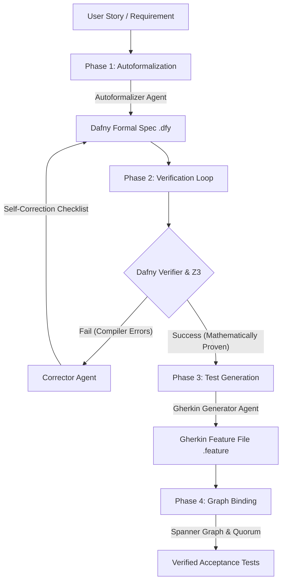

# 🚀 AI-Driven BDD Pipeline with Autoformalization
> **An AI agent pipeline that turns business requirements into compiler-checked Gherkin tests before defects reach production.**

Ambiguous business requirements and logic gaps create costly software defects. This multi-agent pipeline catches requirement defects *before* any code is written, translating natural language user stories into compiler-checked Gherkin Cucumber tests. 

To prevent AI hallucinations, the pipeline uses **Dafny** (a formal verification language backed by an SMT solver) as a compiler-validated guardrail.

---

## ⚡ 1. The 30-Second Demo Path

Here is how the pipeline validates business logic and generates tests in seconds:
1. **Ingest Story**: The agent reads a requirement (e.g., *"allow cash withdrawal"*).
2. **Autoformalize**: The agent writes a formal mathematical specification in Dafny mapping the rules.
3. **Compile & Verify**: The local verifier compiles the spec. If logic gaps or syntax errors exist, a self-correction agent loop automatically interprets the logs and repairs the spec.
4. **Gherkin Output**: Once verified, the agent generates Gherkin acceptance scenarios mapping the proven bounds.
5. **Continuous Ingestion**: The agent binds Gherkin steps to a Spanner Graph, creating stubs and requesting human consent via a plain-English **Vibe Diff** if steps are new.

### 🔍 Concrete Example: ATM Cash Withdrawal
* **The Requirement**: *"A user wants to withdraw cash from their bank account."*
* **The Danger**: If the requirements analyst misses specifying a boundary check, a standard test generator might create a test case that allows a user to withdraw more money than their balance, creating a negative balance defect.
* **Our Pipeline's Defense**: 
  1. The Autoformalizer translates this to a Dafny method with the invariant: `ensures balance >= 0`.
  2. The verifier flags a violation: *"Assertion violation: balance could fall below zero."*
  3. The self-correction loop catches the compiler warning and adds the missing precondition: `requires balance >= amount`.
  4. The verifier passes. The Gherkin generator then produces a verified scenario specifically testing the balance limit, preventing the defect before development begins.

---

## 🏗️ 2. System Architecture & Verification Flow

The pipeline orchestrates specialized agents through a compiler-in-the-loop state machine:



---

## 📋 3. key concepts from the course used in the Capstone Project 

This project demonstrates the key concepts from the course:

| Rubric Concept | Where to Find in Code / Demo |
| :--- | :--- |
| **Agent / Multi-Agent (ADK)** | Coordinates `autoformalizer`, `corrector`, and `gherkin_generator` agents using ADK 2.0 dynamic workflows in [pipeline_adk.py](pipeline_adk.py). |
| **MCP Server** | Defined in [mcp_config.json](mcp_config.json), integrating the `google-developer-knowledge` server to answer generative framework queries. |
| **Antigravity** | Developed and verified in the Antigravity pair-programming agent environment. |
| **Security Features** | Centralized credential loading in [config.py](config.py) + compiler-enforced safety invariants + ABA Monitor Circuit Breaker in [aba_monitor.py](aba_monitor.py). |
| **Deployability** | Deployed live to **Google Cloud Vertex AI Agent Runtime** using `uv tool run google-agents-cli`. |
| **Agent Skills** | Installed 7 CLI skills + created 3 custom workspace skills (`nl-to-dafny`, `ruby-step-scaffolder`, `step-definition-manager`). |

---

## 🛠️ 4. Quickstart: Run a Sample Verification Case

### Prerequisites
* **Python**: v3.11+
* **.NET Runtime**: 10.0 or higher (required by the Dafny compiler)

### Setup
1. **Set Up Virtual Environment**:
   ```bash
   python -m venv .venv
   .\.venv\Scripts\Activate.ps1
   pip install -r requirements.txt
   ```
2. **Download Dafny Compiler**:
   ```bash
   python tools_setup.py
   ```
3. **Configure Environment (.env)**:
   Create a `.env` file in the root directory:
   ```env
   LLM_PROVIDER=gemini
   LLM_MODEL=gemini-2.5-flash
   GEMINI_API_KEY=YOUR_GEMINI_API_KEY
   ```

### Run a Verification Case
Run the pipeline against the sample ATM withdrawal user story:
```bash
python main_adk.py --story stories/sample_story.txt --output features/output_test.feature
```
* **Input File**: `stories/sample_story.txt` (Informal text)
* **Expected Output File**: `features/output_test.feature` (Verified Gherkin test scenarios)

---

## 🔬 5. Deep-Dive: Safety Features & Telemetry

For advanced evaluation, the pipeline incorporates enterprise-grade safety gates and observability:
* **Agent Behavioural Analytics (ABA) Circuit Breaker**: Located in [aba_monitor.py](aba_monitor.py). Prevents token-draining infinite loops and flags semantic intent drift.
* **Evaluator Quorum Consensus Gate**: Intercepts code modifications, translating changes into a plain-English **Vibe Diff** that requires explicit developer authorization before updating files.
* **Google Cloud Spanner Graph**: Connects step definitions to check for direct and transitive dependencies before writing updates.
* **OpenTelemetry Observability**: Mapped inside [telemetry_setup.py](telemetry_setup.py) to export timeline traces directly to the Google Cloud Console.
