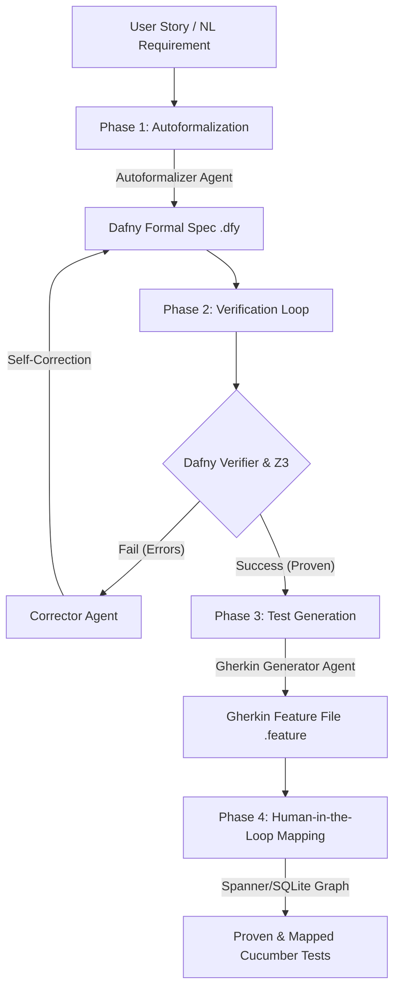

# 🚀 AI-Driven BDD Pipeline with Autoformalization
> **Kaggle AI Agents: Intensive Vibe Coding Capstone Project Submission**

An automated, multi-agent AI pipeline that translates natural language **User Stories** into mathematically verified, edge-case-proof **Cucumber/Gherkin acceptance tests**.

To eliminate LLM hallucinations, logic gaps, and contradictions in business requirements, the pipeline introduces **Dafny** (an SMT solver-backed formal verification language) as an intermediate compiler-validated verification layer.

---

## 📖 1. The Pitch: Problem, Solution & Value

### The Problem
Traditional Behavior-Driven Development (BDD) relies on QA engineers translating business requirements (User Stories) into Gherkin feature files manually. This process is prone to:
1. **Ambiguity and Gaps**: Edge cases and boundary conditions are frequently missed.
2. **Logical Contradictions**: Business rules that conflict are not caught until late-stage integration.
3. **LLM Hallucinations**: Standard AI generators write syntactically correct tests that test incorrect, unverified, or physically impossible system states.

### The Solution
A formal verification pipeline orchestrated by Google's **Agent Development Kit (ADK) 2.0**.
* **Phase 1 (Autoformalization)**: Translates natural language requirements into a formal mathematical model in Dafny.
* **Phase 2 (Self-Correction Loop)**: Compiles and verifies the model using the local Dafny verifier. If logical bugs or syntax errors are detected, a self-correction agent loop interprets the logs and rewrites the specification until it is mathematically proven.
* **Phase 3 (Strict BDD Generation)**: Directly maps the proven state space, preconditions, and postconditions to Cucumber `Given/When/Then` scenarios.
* **Phase 4 (Human-in-the-Loop Mapping & Verification)**: Matches generated Gherkin steps against the Spanner/SQLite Graph. 
  1. **Step Reuse Trajectory**: Reuses existing definitions to avoid duplicates.
  2. **Auto-Generate & Vibe Diff**: Scaffolds new stubs via `ruby-step-scaffolder`, translates changes to a plain-English **Vibe Diff**, and pauses for explicit human consent before committing.
  3. **Auto-Pruning & Telemetry**: Automatically calculates **Step Reuse Coverage** metrics and prunes **orphan Ruby definitions** (definitions with no step bindings) from the Spanner graph.

### Value & Innovation
By enforcing mathematical proof of correctness *before* writing tests, we ensure that:
* Every BDD scenario is logically sound.
* 100% of the boundary limits (e.g. daily limits, positive balances) are tested and proven.
* Hallucinations are prevented by utilizing compilers and SMT verifiers as a hard guardrail.

---

## 🏗️ 2. Overall Agent Architecture



---

## 🎓 3. Demonstration of Key Course Concepts

In accordance with the Capstone Project evaluation rubric, this project demonstrates five (5) key concepts:

### 1. Multi-Agent System (ADK 2.0)
* **Where**: [pipeline_adk.py](pipeline_adk.py)
* **Details**: We use **ADK 2.0 Dynamic Workflows** (`async/await` orchestration) to coordinate three specialized agents:
  1. `autoformalizer`: Translates User Stories to formal state machines.
  2. `corrector`: Analyzes compiler diagnostics and repairs safety postconditions.
  3. `gherkin_generator`: Maps proven states to Cucumber scenarios.
* All agents enforce type safety using Pydantic structured output models (`output_schema`).

### 2. MCP Server Configuration
* **Where**: [mcp_config.json](file:///C:/Users/xwts010/.gemini/antigravity/mcp_config.json)
* **Details**: Configured authentication and endpoint mappings for the `google-developer-knowledge` HTTP-based MCP server. This allows AI coding agents to search and retrieve up-to-date documentation on the Google ADK and Generative Language APIs.

### 3. Pair Programming with Antigravity
* **Where**: Project build history and documentation logs.
* **Details**: Iteratively designed, developed, and verified using the Antigravity pair-programming agent environment to configure testing rigs, debug Windows .NET runtimes, and build setup scripts.

### 4. Security Features
* **Where**: [config.py](config.py), [aba_monitor.py](aba_monitor.py), and [pipeline_adk.py](pipeline_adk.py)
* **Details**: 
  1. **Credential Security**: Strict path segregation. Zero API keys are hardcoded. Paths and configs are loaded from `.env` and structured dynamically using a centralized `SETTINGS.json` file.
  2. **Logical Safety Proofs**: The core verification engine prevents software vulnerabilities. By defining invariants (e.g., class bounds like `balance >= 0`), the SMT verifier mathematically guarantees memory safety.
  3. **Agent Behavioural Analytics (ABA) Circuit Breaker**: Continuously monitors the Agent Bill of Materials (AgBOM) to guard against infinite loops (3 identical outputs) and intent drift (semantic similarity < 0.45), instantly tripping the circuit breaker to prevent token-draining exploits.
  4. **Evaluator Quorum Consensus Gate**: Intercepts all code mutation tool calls, requesting validation from a secondary judge agent, displaying a plain-English **Vibe Diff**, and demanding explicit human developer approval before updating files.

### 5. Deployability & Agent Skills
* **Where**: [bdd-agent-project/](bdd-agent-project/) and global agent skills configuration.
* **Details**:
  1. **Deployability**: Scaffolded using the Google Cloud Agent templates. The `bdd-agent-project` subdirectory includes Terraform scripts and `app/agent_runtime_app.py` wrapper classes configured for deployment to **Vertex AI Agent Runtime** and Google Cloud Run.
  2. **Agent Skills**: Using `uvx google-agents-cli setup`, we installed 7 active skills (`workflow`, `adk-code`, `scaffold`, `eval`, `deploy`, `publish`, `observability`) into the agent's customization root.

---

## 💻 4. Technical Specifications & Environment

### Hardware Specifications
* **CPU**: Intel(R) Core(TM) i7-10850H CPU @ 2.70GHz
* **Cores**: 6 Cores, 12 Logical Processors
* **Memory**: 32.0 GB RAM
* **OS**: Windows 11 Enterprise (Version 22H2 / OS Build 22621.3880)

### Third-Party Software Dependencies
* **Python**: v3.11+ (Tested and verified on Python 3.14.0)
* **.NET Runtime**: 10.0 (Dafny requires .NET to run compilation steps)
* **Dafny Compiler**: v4.11.0 (Automatically downloaded and set up locally in `/tools`)

---

## 🛠️ 5. Installation & Setup

1. **Clone & Set Up virtual environment**:
   ```bash
   python -m venv .venv
   .\.venv\Scripts\Activate.ps1
   pip install -r requirements.txt
   ```
2. **Download Dafny locally**:
   ```bash
   python tools_setup.py
   ```
3. **Environment Setup (.env)**:
   Create a `.env` file in the root directory:
   ```env
   LLM_PROVIDER=gemini
   LLM_MODEL=gemini-2.5-flash
   GEMINI_API_KEY=YOUR_GEMINI_API_KEY
   ```

---

## 🚀 6. Entry Points & Commands

Refer to [entry_points.md](entry_points.md) for more details.

* **Run Automated Tests**:
  ```bash
  python test_pipeline_adk.py
  ```
* **Run Pipeline on a Story file**:
  ```bash
  python main_adk.py --story stories/sample_story.txt --output features/output_test.feature
  ```
* **Run Evaluation-Driven Development (EDD) & LLM-as-a-Judge Scorecard**:
  ```bash
  python run_eval.py
  ```
* **Deploy Live to Google Cloud Agent Runtime**:
  ```bash
  # Ensure you are in the bdd-agent-project directory
  cd bdd-agent-project
  uv tool run google-agents-cli deploy --project <YOUR_GCP_PROJECT_ID>
  ```
