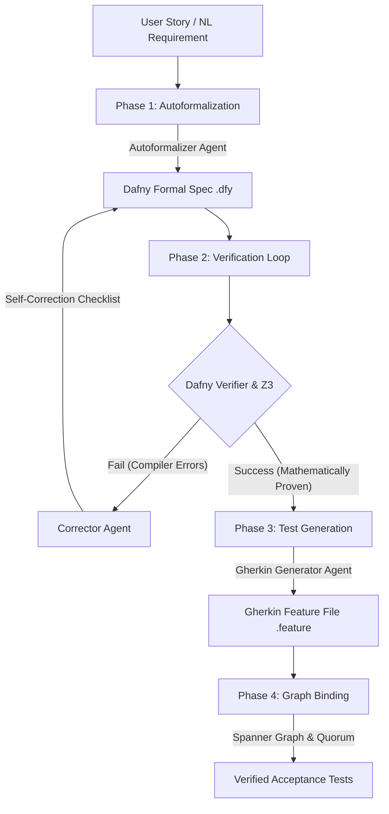

# 🚀 AI-Driven BDD Pipeline with Formal Autoformalization
> **Kaggle AI Agents: Intensive Capstone Project Submission**

An automated, multi-agent pipeline that translates natural language **User Stories** into mathematically verified, edge-case-proof **Cucumber/Gherkin acceptance tests**. 

To eliminate LLM hallucinations, logic gaps, and contradictions in business requirements, the pipeline introduces **Dafny** (an SMT solver-backed formal verification language) as a compiler-validated intermediate representation layer.

---

## 📋 1. Executive Summary & Value Proposition

### The Problem Statement
Traditional Behavior-Driven Development (BDD) relies on manual translation of business requirements into Gherkin feature files. This manual process is prone to:
1. **Ambiguity & Logical Gaps**: Boundary conditions and complex edge cases are frequently overlooked.
2. **Requirements Contradictions**: Conflicting business rules often remain undetected until late-stage integration.
3. **Generative Hallucinations**: Standard AI generators write syntactically correct tests that test incorrect, unverified, or physically impossible system states.

### The Solution: Formal Autoformalization
An automated verification pipeline orchestrated by Google's **Agent Development Kit (ADK) 2.0**:
* **Phase 1 (Autoformalization)**: Translates natural language requirements into a formal mathematical model in Dafny.
* **Phase 2 (Formal Verification Loop)**: Compiles and verifies the model using the Dafny verifier. If logical bugs or syntax errors are detected, a self-correction agent loop interprets the compiler diagnostics and rewrites the specification until it is mathematically proven.
* **Phase 3 (Acceptance Test Generation)**: Maps the proven state space, preconditions, and postconditions directly to Cucumber `Given/When/Then` scenarios.
* **Phase 4 (Continuous Ingestion & Graph Mapping)**: Binds Gherkin scenarios to Spanner Graph nodes. Unmapped steps trigger an Evaluator Quorum consensus gate that performs regex expansion, scaffolds Ruby stubs, computes step-reuse metrics, and prunes orphaned graph definitions.

### Key Innovations & Value
By enforcing mathematical proof of correctness *before* test generation, this pipeline:
* **Guarantees Logical Soundness**: Every generated BDD scenario is backed by an SMT-proven model.
* **Prevents Hallucinations**: Utilizes compiler feedback and Z3 theorem solvers as strict, deterministic guardrails.
* **Optimizes Reusability**: Incorporates graph database traversals to maximize step definition reuse and automatically eliminate dead code.

---

## 🏗️ 2. System Architecture & Verification Flow

The pipeline orchestrates multiple specialized agents through a compiler-in-the-loop state machine:



---

## 🎓 3. Core Agent Framework Design & Integrations

This project implements five key architectural concepts under the Kaggle Capstone evaluation criteria:

### 1. Multi-Agent System (ADK 2.0)
* **Location**: [pipeline_adk.py](pipeline_adk.py)
* **Details**: Coordinates three specialized agents using ADK 2.0 dynamic workflows (`async/await` orchestration):
  1. `autoformalizer`: Translates User Stories to formal state machines.
  2. `corrector`: Analyzes compiler diagnostics and repairs safety postconditions.
  3. `gherkin_generator`: Maps proven states to Cucumber scenarios.
* Enforces type safety via Pydantic structured output models (`output_schema`).

### 2. Model Context Protocol (MCP) Server Configuration
* **Location**: [mcp_config.json](mcp_config.json)
* **Details**: Maps endpoints for the `google-developer-knowledge` HTTP-based MCP server. This allows AI coding agents to search and retrieve up-to-date documentation on the Google ADK and Generative Language APIs.

### 3. Pair Programming with Antigravity
* **Details**: Developed, debugged, and optimized within the Antigravity pair-programming agent environment to build test cases, compile Dafny schemas, and deploy live GCP resources.

### 4. Advanced Security Features
* **Location**: [config.py](config.py), [aba_monitor.py](aba_monitor.py), and [pipeline_adk.py](pipeline_adk.py)
* **Details**: 
  1. **Zero-Secret Hardcoding**: All secrets are isolated from the repository, loading dynamically through system environment variables and Google Application Default Credentials (ADC).
  2. **Mathematical Invariant Proofs**: Enforces system safety parameters (e.g. `balance >= 0`) at the compiler level to ensure code security before test generation.
  3. **ABA Circuit Breaker**: Tracks the execution Bill of Materials (AgBOM) to guard against infinite loops and intent drift (semantic similarity < 0.45), instantly halting execution to prevent resource exhaustion.
  4. **Evaluator Quorum Gate**: Intercepts all code mutation tool calls, requesting validation from a secondary judge agent, displaying a plain-English **Vibe Diff**, and demanding explicit human developer approval before updating files.

### 5. Deployability & Agent Skills
* **Location**: [bdd-agent-project/](bdd-agent-project/)
* **Details**:
  1. **Vertex AI Hosting**: Configured for deployment to **Vertex AI Agent Runtime (Reasoning Engines)**.
  2. **Agent Skills**: Pre-installed with 7 active agent skills (`workflow`, `adk-code`, `scaffold`, `eval`, `deploy`, `publish`, `observability`) to support automated updates.

---

## 💻 4. Technical Specifications & Hardware Environment

### Hardware Specifications
* **CPU**: Intel(R) Core(TM) i7-10850H CPU @ 2.70GHz
* **Cores**: 6 Cores, 12 Logical Processors
* **Memory**: 32.0 GB RAM
* **OS**: Windows 11 Enterprise (Version 22H2 / OS Build 22621.3880)

### Third-Party Software Dependencies
* **Python**: v3.11+
* **.NET Runtime**: 10.0 (Dafny compiler execution requirement)
* **Dafny Compiler**: v4.11.0 (Automatically downloaded and set up locally in `/tools`)

---

## 🛠️ 5. Installation & Dependency Configurations

1. **Set Up Virtual Environment**:
   ```bash
   python -m venv .venv
   .\.venv\Scripts\Activate.ps1
   pip install -r requirements.txt
   ```
2. **Download Dafny Compiler**:
   ```bash
   python tools_setup.py
   ```
3. **Environment Credentials (.env)**:
   Create a `.env` file in the root directory:
   ```env
   LLM_PROVIDER=gemini
   LLM_MODEL=gemini-2.5-flash
   GEMINI_API_KEY=YOUR_GEMINI_API_KEY
   ```

---

## 🚀 6. Execution Reference & Deployment Entry Points

Refer to [entry_points.md](entry_points.md) for more details.

* **Run Automated Tests**:
  ```bash
  python test_pipeline_adk.py
  ```
* **Run Pipeline on a Story file**:
  ```bash
  python main_adk.py --story stories/sample_story.txt --output features/output_test.feature
  ```
* **Run Evaluation-Driven Development (EDD) & LLM-as-a-Judge Scorecard**:
  ```bash
  python run_eval.py
  ```
* **Deploy Live to Google Cloud Agent Runtime**:
  ```bash
  # Navigate to the agent project directory
  cd bdd-agent-project
  uv tool run google-agents-cli deploy --project <YOUR_GCP_PROJECT_ID>
  ```
